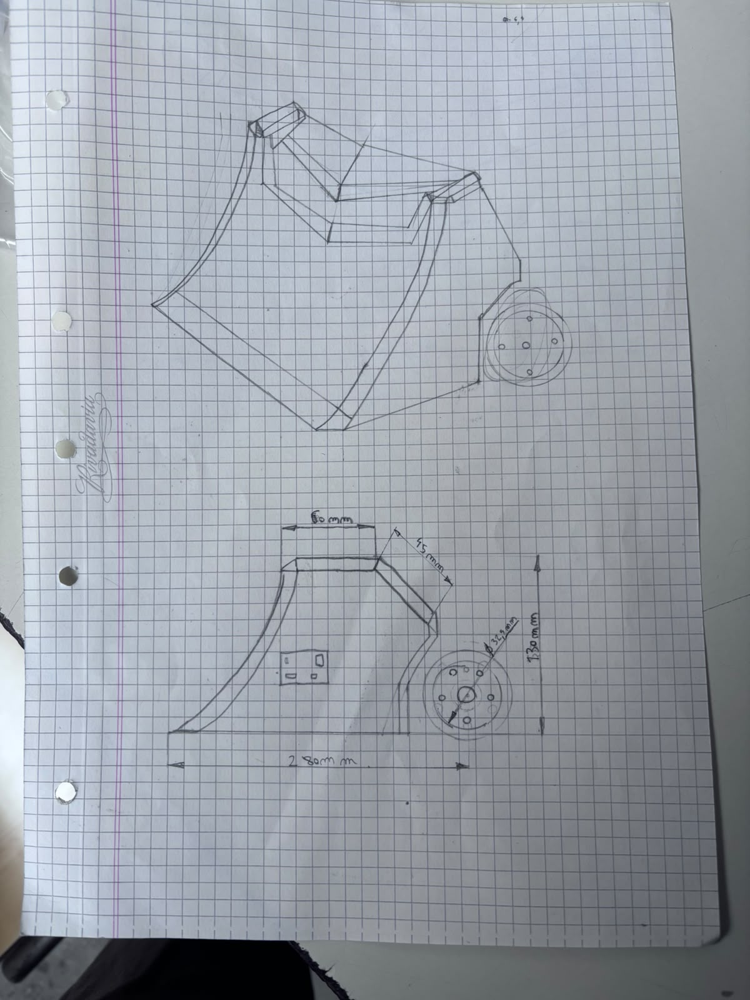

# BITÁCORA DE PROYECTO – ROBOT SUMO

## Equipo: _GGBN______________________________
## Nombre del Robot: ___Bebron___________________
## Capitán: ________Benicio Altonaga_______________________
## Subcapitán: ______Gonzalo Benmaor______________________
## Integrantes:
-Gianfranco Almirón
-Benicio Barri
-NIcolás Estevez

## REGISTRO DE ACTIVIDADES
### Fecha: 13/07/26
### Integrantes presentes:
-Benicio Altonaga
-Gonzalo Benmaor
-Gianfranco Almirón
-Benicio Barri
-Nicolás Estevez

### Objetivos de la jornada:
-hacer un gráfico del vehículo
-definir métodos de defensa
-probar el puente H
-investigar el peso de los componentes
-hacer el diagrama esquematico del puente H y los componentes

### Actividades realizadas:
-investgación del peso de los componentes:
los motores pesan aprox 30 g
la rueda direccional pesa aprox entre 30 y 40 g
las ruedas pesan 28 g
-gráfico del vehículo
-diagrama esquematico del puente H y las conexiones

### Problemas encontrados:
-no pudimos probar el puente H porque no llegamos a programar la Raspberry.
-
-

### Soluciones implementadas o propuestas:
-terminar de programar la Raspberry
-
-

### Pruebas realizadas:
-probamos los motores con 5 volts
-
-

### Resultados obtenidos:
-salió bien la prueba de motores
-
-

### Fotografías, diagramas o evidencias: (Adjuntar imágenes, capturas de pantalla o esquemas):

### Tareas pendientes:
-probar el puente H
-definir el método de ataque y sus materiales
-

### APORTES INDIVIDUALES
Integrante: _Gianfranco Almirón___________________________

Tarea realizada:esquema del puente H y terminar de buscar la información faltante del puente H

Integrante: _Benicio Barri___________________________

Tarea realizada: investigación de métodos de defensa y elegir el más conveniente, peso de los componentes

Integrante: _Nicolás Estevez___________________________

Tarea realizada:esquema del vehículo y las mediciones de los componentes, y sus materiales

Integrante: __Benicio Altonaga__________________________

Tarea realizada: bitácora, ayudar en la elección y croquis del método de defensa

Integrante: _Gonzalo Benmaor___________________________

Tarea realizada: programó la Raspberry Pi Pico w
