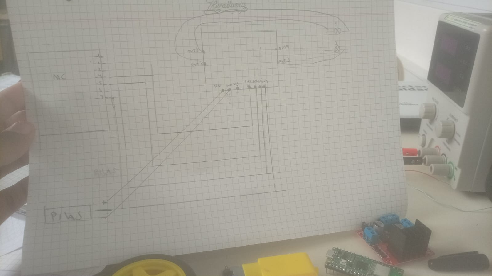

# BITÁCORA DE PROYECTO – ROBOT SUMO

## Equipo: _GGBN______________________________
## Nombre del Robot: ___Bebron___________________
## Capitán: ________Benicio Altonaga_______________________
## Subcapitán: ______Gonzalo Benmaor______________________
## Integrantes:
- Gianfranco Almirón
- Benicio Barri
- NIcolás Estevez

## REGISTRO DE ACTIVIDADES
### Fecha: 13/07/26
### Integrantes presentes:
- Benicio Altonaga
- Gonzalo Benmaor
- Gianfranco Almirón
- Benicio Barri
- Nicolás Estevez

### Objetivos de la jornada:
- Hacer un gráfico del vehículo
- Definir métodos de defensa
- Probar el puente H
- Investigar el peso de los componentes
- Hacer el diagrama esquematico del puente H y los componentes

### Actividades realizadas:
- Investgación del peso de los componentes:
 Los motores pesan aprox 30 g
 La rueda direccional pesa aprox entre 30 y 40 g
 Las ruedas pesan 28 g
- Gráfico del vehículo
- Diagrama esquematico del puente H y las conexiones

### Problemas encontrados:
- No pudimos probar el puente H porque no llegamos a programar la Raspberry.
-
-

### Soluciones implementadas o propuestas:
- Terminar de programar la Raspberry
-
-

### Pruebas realizadas:
- Probamos los motores con 5 volts
-
-

### Resultados obtenidos:
- Salió bien la prueba de motores
-
-

### Fotografías, diagramas o evidencias: (Adjuntar imágenes, capturas de pantalla o esquemas):

### Tareas pendientes:
- Probar el puente H
- Definir el método de ataque y sus materiales
-

### APORTES INDIVIDUALES
Integrante: _Gianfranco Almirón___________________________

Tarea realizada:esquema del puente H y terminar de buscar la información faltante del puente H

Integrante: _Benicio Barri___________________________

Tarea realizada: investigación de métodos de defensa y elegir el más conveniente, peso de los componentes

Integrante: _Nicolás Estevez___________________________

Tarea realizada:esquema del vehículo y las mediciones de los componentes, y sus materiales

Integrante: __Benicio Altonaga__________________________

Tarea realizada: bitácora, ayudar en la elección y croquis del método de defensa

Integrante: _Gonzalo Benmaor___________________________

Tarea realizada: programó la Raspberry Pi Pico w
