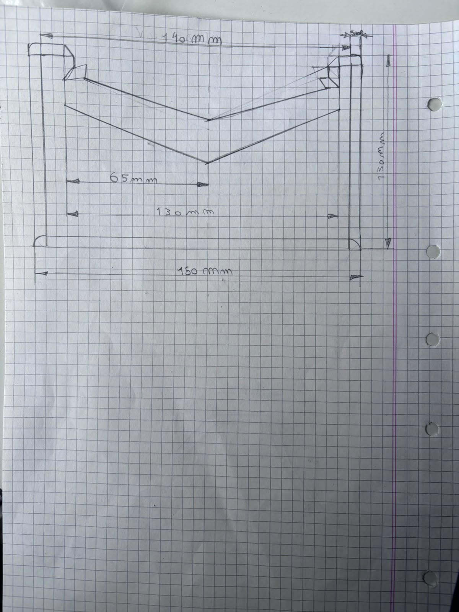

# estructura

hoy definimos como va a ser la estructura del robot usando el dibujo que hicimos en la hoja cuadriculada y aca estan detalladas cada una de las partes que la forman

la pala delantera o rampa tiene un ancho de 140 mm y la diseñamos con una caida bien inclinada para que llegue casi a tocar el suelo. esto sirve para meternos abajo del rival cuando choque de frente, levantarle las ruedas y empujarlo fuera de la pista.

los laterales del chasis protegen las ruedas para evitar golpes directos sobre los ejes y mejorar la resistencia de la estructura.

en la parte trasera del robot van ubicados los dos motores amarillos con reductora, cada uno conectado a una rueda de traccion. elegimos esta distribucion porque deja la mayor parte del peso sobre las ruedas motrices, mejora el agarre y permite empujar con mas fuerza al rival.

en la parte central del chasis va colocado el portapilas de cuatro pilas aa, aprovechando el espacio disponible y manteniendo un buen equilibrio del peso.

los puntos de fijacion de los motores van a estar diseñados para usar tornillos m2 o m3 junto con los soportes que vienen en el kit, de forma que los motores queden bien sujetos y no se muevan durante los impactos.

en la parte delantera inferior va la rampa y en la parte trasera inferior se ubicara la rueda loca, que sirve como tercer punto de apoyo y permite que el robot gire con facilidad sin arrastrar el chasis por el piso.

